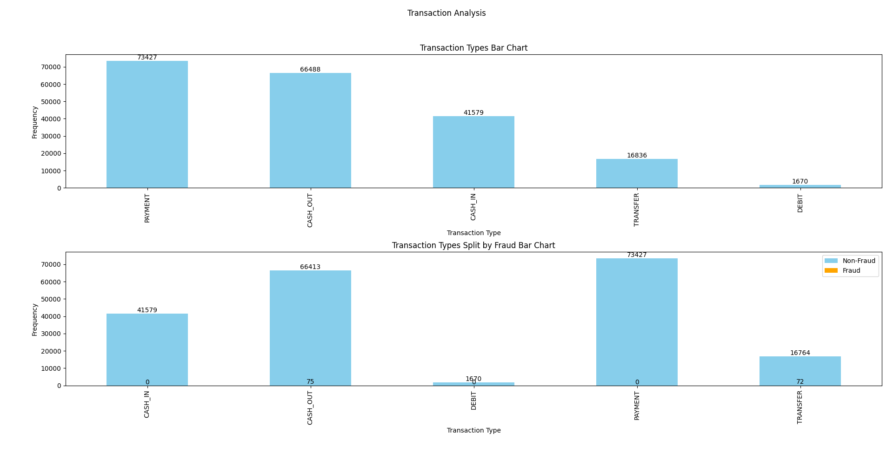
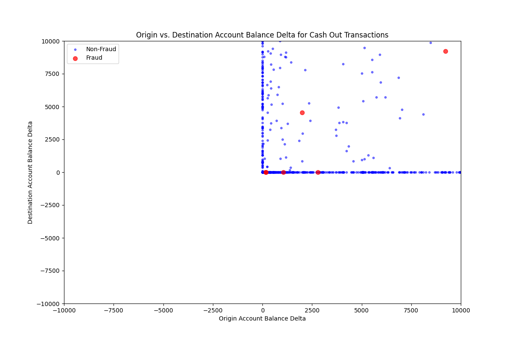

# jpmc-financial-fraud-project
Analysis of large datasets for detecting fraud in financial payment services as part of JPMorgan & Chase job simulation experience.

The dataset is a subset of https://www.kaggle.com/ealaxi/paysim1/version/2 which was originally generated as part of the following research:

E. A. Lopez-Rojas , A. Elmir, and S. Axelsson. "PaySim: A financial mobile money simulator for fraud detection". In: The 28th European Modeling and Simulation Symposium-EMSS, Larnaca, Cyprus. 2016

```markdown
# JPMorgan Chase Financial Fraud Detection

## Overview

This project involves analyzing financial transaction data to detect potential fraud. The dataset contains various types of transactions, and the goal is to extract insights and create visualizations to understand the nature of these transactions better.

## Installation

To get started with this project, you'll need to set up your Python environment and install the required libraries. Below are the installation instructions:

### 1. Clone the Repository

First, clone the repository to your local machine:

```bash
git clone https://github.com/yourusername/jpmc-financial-fraud-project.git
cd jpmc-financial-fraud-project
```

### 2. Set Up a Virtual Environment

Create a virtual environment to manage dependencies:

```bash
python -m venv venv
```

Activate the virtual environment:

- **On Windows:**

    ```bash
    venv\Scripts\activate
    ```

- **On macOS/Linux:**

    ```bash
    source venv/bin/activate
    ```

### 3. Install Required Libraries

Install the necessary Python libraries using `pip`:

```bash
pip install pandas matplotlib
```

## Usage

Here’s how to use the scripts provided in this repository:

1. **Run the Main Script**

   The main script, `task1.py`, performs various data analysis tasks and generates visualizations. To run it, use:

   ```bash
   python task1.py
   ```

2. **Functions Overview**

   - **`exercise_0(file)`**: Reads the CSV file and prints the first few rows.
   - **`exercise_1(df)`**: Returns a list of column names from the DataFrame.
   - **`exercise_2(df, k)`**: Returns the first `k` rows from the DataFrame.
   - **`exercise_3(df, k)`**: Returns a random sample of `k` rows from the DataFrame.
   - **`exercise_4(df)`**: Returns a list of unique transaction types.
   - **`exercise_5(df)`**: Returns a Pandas Series of the top 10 transaction destinations with frequencies.
   - **`exercise_6(df)`**: Returns all rows where fraud was detected.
   - **`exercise_7(df)`**: Returns a DataFrame showing the number of distinct destinations each source has interacted with, sorted in descending order.
   - **`visual_1(df)`**: Creates bar charts for transaction types and their breakdown by fraud status.
   - **`visual_2(df)`**: Creates a scatter plot for Cash Out transactions showing the relationship between origin and destination account balance delta.
   - **`exercise_custom(df)`**: Performs a custom analysis of the dataset (e.g., distribution of transaction amounts).
   - **`visual_custom(df)`**: Creates a histogram for the distribution of transaction amounts.

## Code Examples

### Example 1: Getting Column Names

```python
import pandas as pd

df = pd.read_csv('transactions.csv')
column_names = exercise_1(df)
print(column_names)
```

### Example 2: Plotting Transaction Types

```python
import matplotlib.pyplot as plt

print(visual_1(df))
plt.show()
```

## Screenshots

Below are some example screenshots of the visualizations generated by this project:

### Transaction Types Bar Chart & Transaction Types Split by Fraud Bar Chart



### Cash Out Transactions Scatter Plot



### Distribution of Transaction Amounts


## Contributing

Feel free to contribute to this project by opening issues or submitting pull requests. Please follow the standard GitHub workflow for contributions.


## Contact

For any questions or feedback, please reach out to:

- **Syed Ibrahim Khalil**: [syedibrahimkhalil@protonmail.com](mailto:syedibrahimkhalil@protonmail.com)
```
